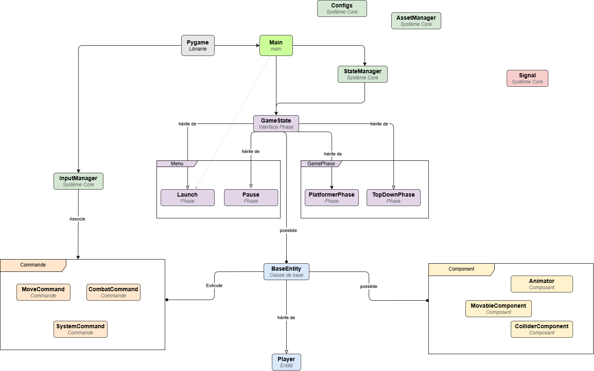

#  Esir-game-KKRE

Un jeu vidéo 2D en construction avec un moteur de jeu polyvalent développé avec **Pygame**, alternant entre des phases différentes. Ce projet met l'accent sur une architecture modulaire de type **ECS (Entity Component System)** pour une grande flexibilité.

<p align="center" style="background-color: #f0f0f0; padding: 10px; border-radius: 10px;">
  
</p>

Projet dans le cadre des enseignements de l'ESIR par :

- Rayan Barhada
- Etienne Carlier
- Keyvan Dahlem
- Kerrian Chalulaux

---

## Installation et lancement du jeu
Assurez-vous d'avoir Python 3.11 ou plus récent.
1. **Cloner le dépôt** :
   ```bash
   git clone https://github.com/Arckedo/Esir-game-KKRE.git
   cd Esir-game-KKRE
   ```

2. **Installer Pygame** :
   ```bash
   pip install pygame
   ```
> Si ca ne fonctionne pas avec la version classique. Essayer de télécharger la Community Edition version :  Pygame-ce 2.4.0+ .  

2. **Lancer le jeu** :
   ```bash
   python main.py
   ```    

> Si vous rencontrez des erreurs de chemin d'accès (assets non trouvés), assurez-vous de lancer la commande python main.py depuis la racine du dossier du projet.
---

## Fonctionnalités principales


* **Architecture Modulaire** : Utilisation d'entités (`BaseEntity`) et de composants (`Movable`, `Animator`, `Sprite`, etc.) pour un code propre et réutilisable.
* **Système d'Etats (Scènes)** : Gestion des différents menu et scènes via des états (Launcher, Menu, Platformer2D). 
* **Système de Physique** :
    * Gestion des collisions précises (Masques et Rects).
    * Logique de **Step-Up** permettant de franchir de petites marches sans sauter.
    * Gravité et inertie configurables.
* **Système d'Animation** : Machine à états intégrée (`set_state`) pour des transitions fluides entre idle, run, jump, etc.
* **Combat & Projectiles** :
    * Patterns de tirs circulaires.
    * Projectiles configurables (collision avec les murs ou balles spectrales).
    * Effets de feedback visuel (Flash blanc lors des dégâts).
* **Importation LDTK** : Facilité l'importation de niveau via des fichiers json LDTK.
* **Débugage visuel** : Activation simple des hitboxs, du nombre d'FPS et autres données.
---

## Evolution du projet

| Fonctionnalité | État | Description |
| :--- | :---: | :--- |
| **Moteur ECS de base** | ✅ | Architecture BaseEntity + Components opérationnelle. |
| **Physique & Collisions** | ✅ | Gestion des masques, gravité et système de Step-Up. |
| **Système d'États** | ✅ | Transitions Menu / Launcher / Jeu fonctionnelles. |
| **Mode Platformer** | 🏗️ | Intégration des niveaux LDTK et déplacements avancés. |
| **Intelligence Artificielle** | 🏗️ | Comportements des ennemis et patterns de tir. |
| **Multiplayer Local** | 🏗️ | Développement d'un multijoueur local à la manette.
| **Launcher** | 📅 | Développement d'un laucher fait en fonction des choix liées au mode platformer |
| **Menu Pause** | 📅 | Développement d'un menu pause pour stopper le jeu et configurer les touches |

> **Légende :** ✅ Terminé | 🏗️ En cours | 📅 Prévu
